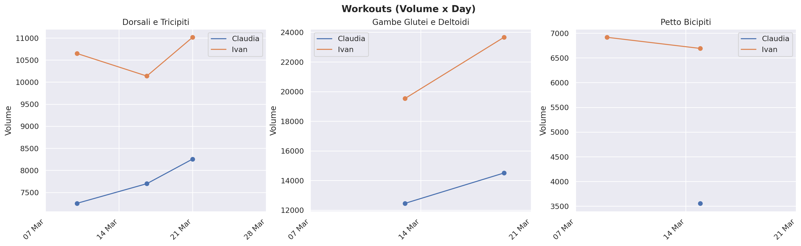
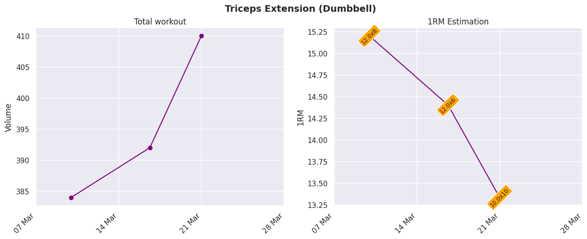

# Lifting Report
Weightlifing reports for total volume and 1RM estimation using Strong [1] CSV format. One rep maximum estimation is computed using the Epley formula [2]. It supports multiple users as long as multiple csv files are provided.
Assisted excersises like Assisted Pull Ups or Assisted Triceps Dips are defined with negative weight, the total volume is computed with (Person Weight - Assisted negative weight) x (Reps) x (Series). The last notebook cell provides a PDF export of all the produced charts.

[1] https://www.strong.app/  
[2] Epley, Boyd (1985). "Poundage Chart". Boyd Epley Workout. Lincoln, NE: Body Enterprises. p. 86.
